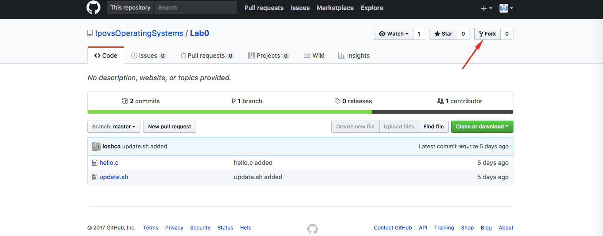
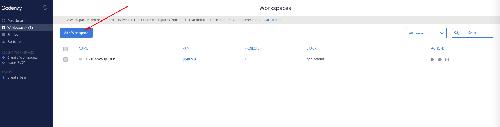
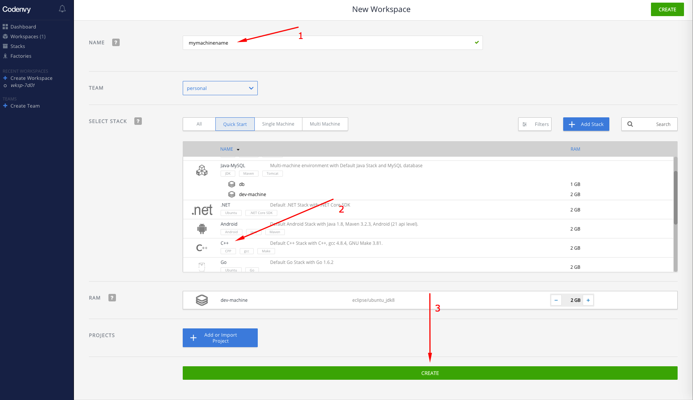
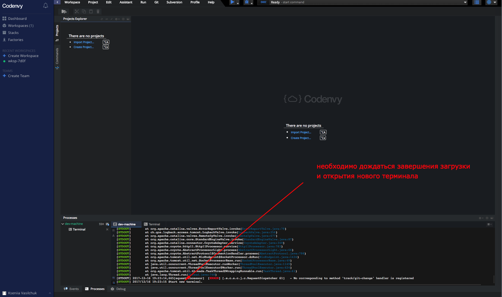
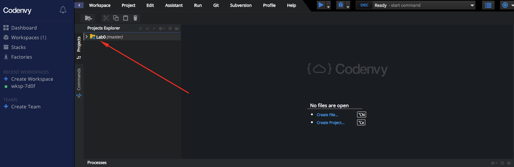
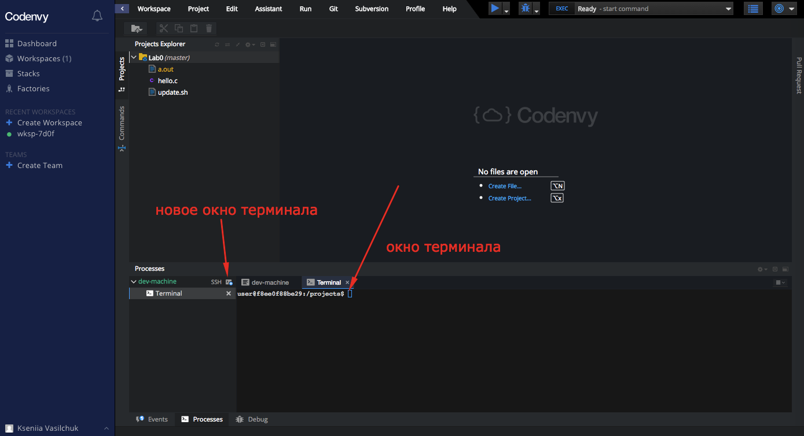
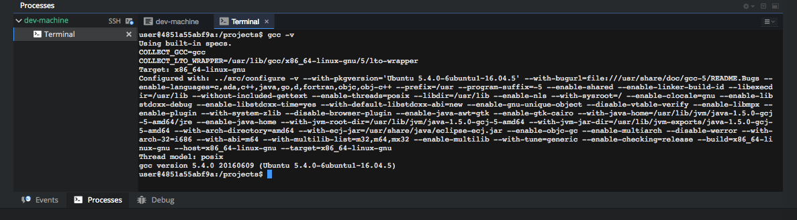

# Лабораторная работа №0

### О курсе

Это обновленный курс "Операционные системы". Нулевая лабораторная работа будет посвящена настройке и использованию инструментов, с которыми вам придется работать весь курс.

## Slack

Slack - это основной вид связи с преподавателями этого курса. Что более важно это вид связи между всеми студентами этого курса. Главная фишка Slack, которую будут здесь использовать это каналы. Вот некоторые из них:

*  **general** - все, что будет касаться всего курса  в общем будет анонсироваться сюда.
*  **lab0...lab7** - каналы для каждой лабораторной работы. Сюда можно задавать вопросы, если что-то изменится в материалах, или где-то будет найдена ошибка, то это будет в соответсвующем канале. Также здесь вы можете просить помощи друг друга, эти каналы будут доступны для всех 3х групп, которые будут проходить этот курс.
*  **ipovs34, ipovs35, vm30** - закрытые каналы для групп. Если будут какие-то переносы, анонсы для конкретных групп, то это будет в этих каналах.
*  **feedback** - канал для связи с преподавателями
*  другие каналы по мере необходимости

У Slack есть мобильные и desktop'ые клиенты, поэтому необязательно заходить исключительно через веб. 

# Задание 1

Отправить свой электронный адрес, на [opsystemsipovs@gmail.com](opsystemsipovs@gmail.com) c темой Slack. В теле письма указать ФИО и группу. Когда кто-то преподавателей увидит ваше письмо, он пришлет на указанный адерс приграшение в Slack, которое необходимо затем принять.

## GitHub

Вам понадобится аккаунт GitHub. Поэтому, если все еще нет, то зарегистрироваться можно [здесь](https://github.com/). Теперь вам необходимо выполнить fork репозитария с заданием. Для первой лабы он находится [здесь](https://github.com/IpovsOperatingSystems/Lab0).

Кнопка fork

## Codenvy

Основная площадка для работы. Представляет собой рабочую среду в операционной системе Linux. Здесь также необходимо зарегистрироваться - [регистрация](https://codenvy.io/site/login). Рекомендуется использовать для входа аккаунт GitHub.

### Troubleshooting

**Некоторые почтовые сервисы занесены Codenvy в черный список. Поэтому, если основной адрес электронной почты, привязанный к вашему GitHub аккаунту, входит в этот список (туда точно входит почтовые сервисы yandex.ru и mail.ru), то при регистрации у вас возникнет ошибка. Чтобы зарегистрироваться вам необходимо сменить основной адрес на GitHub (это можно сделать в Settings). Известно, что почта в домене gmail.com и edu.miet.ru точно подходит для регистрации.**

## Создаем workspace и выкачиваем репозиторий
После регистрации необходимо создать новый workspace. Для этого во вкладке workspaces необходимо нажать "Add Workspace".

Далее необходимо указать имя машины, дефолтный стек, в нашем случае C++, и нажать кнопку "Create".

Запускаем workspace, если он не был запущен автоматически, и переходим в него.

Ждем завершения загрузки.

## Импорт проектов

Теперь необходимо заимпортировать проект. Для этого необходимо перейти Workspace -> Import Project.

В пункте Source Control выбрать Github, в строке URL указать ссылку вашего репозитария(который был создан после fork) с заготовкой для лабы (это важно потому, что иначе вам придется разбираться, как потом внести изменения в Ваш репозитарий).

Если все было сделано правильно, то вы увидите проект в Project Explorer.

## Terminal

Большинство заданий курса будет задействовать терминал. Окно терминала автоматически откроется, как только закончится запуск workspace, но по мере необходимости вы можете открывать бесконечно много новых вкладок с терминалом.

## Навигация
По умолчанию *Codenvy* открывает терминал в директории */projects/*. 

На этом этапе можно поговорить, как *Codenvy* вообще работает. Вы уже создали workspace, а значит *Codenvy*, где-то хранит под него данные в виде проектов. Когда вы запускаете workspace *Codenvy* запускает для вас [Docker](https://ru.wikipedia.org/wiki/Docker) контейнер, вам не обязательно знать, как он работает, но **что важно помнить: каждый раз, когда вы завершаете работу в workspace, сохраняются только ваши проекты. Все, что будет сохранено вне проектов может быть утерено при новом запуске**. 

Немножко базовых функций для навигации по файловой системе:

* `cd [path]` - команда для смены рабочей директории
* `ls [path]` - показывает содержимое директории
* `pwd` - команда, чтобы определить, в какой директории вы находитесь сейчас
* `touch file` - команда, которая создаст для вас пустой файл.
* `mkdir dir` - команда для создания новой директории.
* `cp file1 file2` - копирует из одного файла в другой
* `mv file1 file2` - перемещает файл из одного места в другое
* `rm file` - удаление файла
* `echo` - вывод в окно терминала

# Задание 2

Вам необходимо разобраться, как работают эти команды более детально. Время познакомиться с еще одной особенностью курса - наличие заданий на поиск информации. Многие задания этого курса будут заключаться в том, чтобы найти решение самому, поэтому *google* ваш главный помощник. Это очень сложный навык, поэтому в первый раз мы протянем вам [руку помощи](http://lmgtfy.com/?q=filesystem+navigation+linux). 

Лучший интро по версии преподавателей можно найти [тут](https://www.digitalocean.com/community/tutorials/basic-linux-navigation-and-file-management)

**В качестве задания вам необходимо с помощью терминала:**

* в проекте Lab0 создать папку типа "lab0\_Ivanov\_Ivan\_IPOVS\_34"
* внутри этой папки создать пустой файл "empty"
* скопировать файл hello.c из Lab0/src в новую папку
* переименовать его в "newhello.c"

## update.sh
<!--update.sh обновить, чтобы не требовал участия пользователя-->
В предыдущем задании вы уже столкнулись с выполнением программ в терминале ОС Linux. Есть два способа вызвать программу в терминале:

1. Указать ее полный или относительный путь. Например утилита mv (move), которая находится в директории /bin/ может быть вызвана `/bin/mv`, но если вы уже находитесь в директории /bin/ вы можете вызвать ее по относительному пути `./mv`.
2. Добавить директорию, в которой находится программа в переменную окружения PATH. Тогда вы сможете вызывать программу, не указывая ее путь, например: `touch empty`. Базовые утилиты, которые вы уже использовали для создания новой папки, копирования и пеименования файлов, добавлены в PATH по умолчанию.

В рамках курса мы будем использовать различные консольные утилиты, которые  *Codenvy* по умолчанию не устанавливает. А еще *Codenvy* не сохраняет вам окружение между запусками, а это значит, что при каждом новом запуске workspace вам придется переустанавливать некоторый набор утилит. Мы постарались облегчить вам этот процесс, добавив в каждый проект скрипт **update.sh**.

# Задание 3
<!-- ping устанавливается в update.sh -->
**Запустите update.sh, который находится в /projects/Lab0/** 

Чтобы проверить, что вы все сделали верно, выполните команду: `ping ya.ru -с 5`, если вы увидели, что-то вроде этого, то вы все сделали правильно:

	PING ya.ru (87.250.250.242) 56(84) bytes of data.
	64 bytes from ya.ru (87.250.250.242): icmp_seq=1 ttl=38 time=107 ms
	64 bytes from ya.ru (87.250.250.242): icmp_seq=2 ttl=38 time=107 ms
	64 bytes from ya.ru (87.250.250.242): icmp_seq=3 ttl=38 time=107 ms
	64 bytes from ya.ru (87.250.250.242): icmp_seq=4 ttl=38 time=107 ms
	64 bytes from ya.ru (87.250.250.242): icmp_seq=5 ttl=38 time=107 ms
	
	--- ya.ru ping statistics ---
	5 packets transmitted, 5 received, 0% packet loss, time 4004ms
	rtt min/avg/max/mdev = 107.155/107.176/107.204/0.293 ms

## gcc
<!-- todo: предлагаю устанавливать gcc на всякий случай в update.sh -->

Ваши проекты обычно это всего лишь программный код, который представляет собой просто текстовые файлы, но ваш код компилируется не с помощью магии (даже, если в Visual Studio это выглядело именно так) - вам нужен компилятор. Помните, когда вы создавали workspace вы указали стек - C++? Таким образом вы попросили *Codenvy* установить gcc для вас, а значит мы уже можем выполнить первую команду в терминале:

`gcc -v`

Вы должны увидеть что-то типо такого:

Если это так, то смело читайте дальше, если вы увидели сообщение "command not found", то вероятнее всего вы не выбрали стек C++ при создании workspace.

## Задание 4

После выполнения всех заданий у вас должна быть создана ваша папка с newhello.c внутри. Необходимо его скомпилировать:
`gcc newhello.c -o hello`.

В вашей папке должен появиться исполняемый файл **hello**. Запустите его. Вы должны увидеть сообщение "Hello, world!".

Перед тем, как сдавать работу преподавателю, необходимо закоммитить ваши изменения, для этого из созданной вами директории необходимо выполнить: 

1. `git add empty` - добавит ваш созданный пустой файл в репо
2. `git add newhello.c` - добавит ваш c-файл в репозиторий
3. Перейти в директорию Lab0
4. Выполнить `git status` и убедиться, что вы добавили в репозиторий только файлы **empty и newhello.c**. **Файл hello не должен быть добавлен!**
5. Выполнить `git commit -m "добавлен hello.c и empty"`
6. Выполнить `git push`
7. Убедиться через веб интерфейс GitHub, что ваши файлы закоммичены и находятся в репозитории

## Вопросы на защиту
<!--todo-->

## Про обратную связь

Материалы данного курса могут содержать ошибки, опечатки и неточности. Если вы заметили, что-то, что нужно поправить напишите об этом в канал #feedback.

